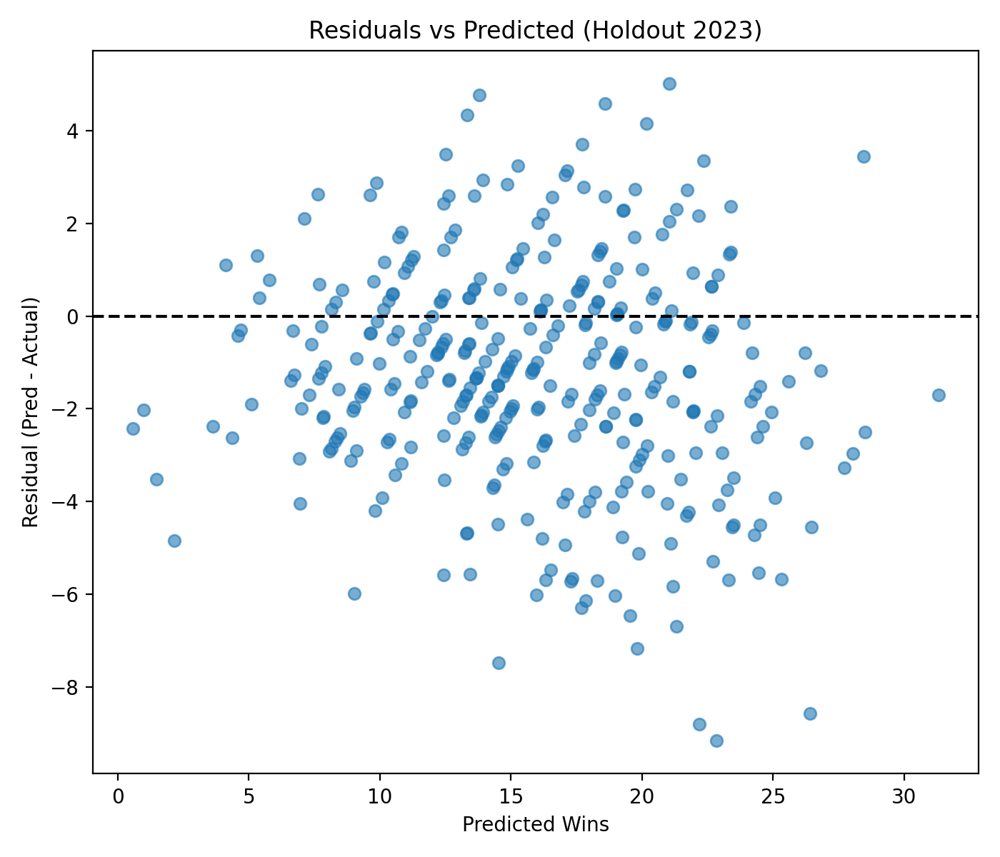

# NCAA Men's Basketball Wins Prediction

## Overview
This project predicts regular‑season wins for NCAA Division I men’s basketball teams using team‑season advanced stats. The workflow is deliberately simple and interpretable, with season‑based evaluation and clear artifacts (metrics tables and figures) suitable for a portfolio.

## Project History (DATA 110)
This started as a DATA 110 group project. I later redid the analysis independently after identifying evaluation issues in the original notebook. Fixes in this repo include:
- **Season leakage risk**: the original used random train/test splits that mixed seasons; I replaced it with a season‑holdout test and rolling‑year evaluation.
- **Limited metrics**: the original reported only R²; I added MAE and RMSE plus a clear “average error in wins.”
- **No baselines**: I added two baselines (mean wins and ADJOE−ADJDE) for honest comparison.
- **Missing diagnostics**: I added residual plots, learning curves, and multicollinearity checks (correlations + VIF).

## Data
- **Source**: NCAA-M Basketball Datasets from: https://barttorvik.com/trank.php#
- **Granularity**: One row per team‑season.
- **Seasons used**: 2013–2023 plus the 2020 file (combined into a single dataset with `YEAR=2020`).
- **Target**: `W` (regular‑season wins).
- **Features used** (all from the dataset):
  - `ADJOE`, `ADJDE`, `EFG_O`, `EFG_D`, `TOR`, `TORD`, `ORB`, `DRB`, `FTR`, `FTRD`, `2P_O`, `2P_D`, `3P_O`, `3P_D`, `ADJ_T`

Raw data files are stored in `data/` and loaded with relative paths.

## Method
1. **Season‑based evaluation**
   - **Holdout**: Train on all seasons before 2023, test on 2023.
   - **Rolling evaluation**: Train on years `< year` and test on each of 2019–2023.
2. **Baselines**
   - Mean wins from the training set.
   - Linear regression on `ADJOE - ADJDE` only.
3. **Models** (all standardized):
   - Linear Regression
   - RidgeCV
   - LassoCV
4. **Robustness checks**
   - Feature correlations and VIF (saved to `results/feature_correlations.csv` and `results/vif.csv`).

## Results (Holdout 2023)
- **Chosen model**: Linear Regression (simplest model within 0.1 MAE of the best holdout score).
- **Holdout R²**: **0.807**
- **Holdout MAE**: **2.16 wins** (average error)
- **Holdout RMSE**: **2.74 wins**

Baselines for comparison (holdout 2023):
- Mean baseline MAE: **5.08 wins**
- `ADJOE - ADJDE` baseline MAE: **3.14 wins**

Full metrics table: `results/metrics.csv`.
Top over/under‑predictions: `results/top_errors.csv`.

### Plots



## How to Run
From the project root:

```bash
python src/run_pipeline.py
```

This will regenerate:
- `results/metrics.csv`
- `results/top_errors.csv`
- `results/holdout_summary.csv`
- `results/feature_correlations.csv`
- `results/vif.csv`
- Plots in `figures/`

## Repository Structure
```
.
├─ data/
├─ figures/
├─ notebooks/
│  └─ wins_prediction.ipynb
├─ results/
├─ src/
│  └─ run_pipeline.py
├─ README.md
└─ requirements.txt
```

## Limitations
- **Same‑season features**: Stats like ADJOE/ADJDE are computed from games in that season, so this is not a true pre‑season forecast.
- **Multicollinearity**: Shooting metrics are highly correlated (VIF is high for EFG/2P/3P features), which can destabilize coefficients.
- **Unmodeled factors**: Injuries, roster changes, and schedule strength nuance are not explicitly modeled.

## Acknowledgments
- Dataset provided for DATA 110 course use.
- Data cleaning and project scaffolding were done with assistance from OpenAI Codex.

## Next Steps
- Add team‑level random effects or a simple hierarchical model.
- Explore reduced feature sets to address multicollinearity.
- Test a pre‑season version using only prior‑year features.
